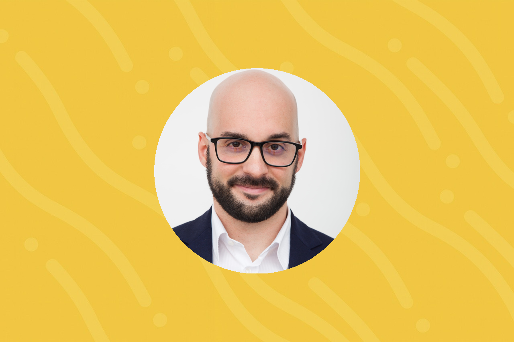

## Chi sono

Campano d'origine, milanese di formazione, austriaco d'adozione.  
Da giovane ho contratto una gravissima malattia: l'ossessione per il computer.  
Dall'assemblarne i pezzi a dimostrarne astrattissime proprietà formali, questa mia passione ha catturato una buona parte del mio tempo, sia di studio, che di svago, che di lavoro.

Da sempre cerco di ritagliarmi un po' di tempo per tentare di migliorare la società in cui vivo.  
L'ho fatto tramite l'associazionismo, il software open source, e la partecipazione politica.

Per la mia prima volta in cabina elettorale, a 18 anni, ho votato _Fare per Fermare il Declino_, un nuovo partito che prometteva di rimettere a posto i conti pubblici per far tornare l’Italia in carreggiata.  
Purtroppo, 12 anni dopo, siamo ancora qui, in un Paese decadente che non riesce a risollevarsi.

Le deludenti iniziative politiche di questi anni sono lo specchio di questa realtà: un Paese arroccato sulle rendite di posizione e a difendere ogni briciola di diritti acquisiti — che siano le rendite catastali, le pensioni, o un lavoro non più in grado di produrre valore aggiunto.

L’8 luglio scorso ho risposto per gioco alla sfida lanciata da Michele e Alberto, e di lì a poco ho conosciuto i primissimi volontari, assieme ai quali ho messo su una prima versione del sito web.  
Pian piano abbiamo costruito il nucleo di 25 persone oggi chiamato “IT” che lavora al Drin Drin con l’obiettivo di garantire strumenti all’avanguardia e capaci di rispondere ai bisogni di una comunità così grande e attiva.

Sono molto grato dell’opportunità che ho avuto: in questi mesi qualche persona è andata, ma molte sono venute, e ciò che mi rende molto orgoglioso è vedere l’incredibile qualità ed energia che ognuna di queste investe per dare al Paese una prospettiva concreta di risveglio.

Fin dal primo giorno ho accettato questa sfida con un obiettivo semplice:  
> Poter, per la prima volta nella mia vita, mettere una croce in cabina elettorale convinto di stare facendo il meglio per l’Italia.

Con questo stesso spirito, **mi candido a Delegato al Congresso**, per poter continuare il lavoro che abbiamo iniziato e trasformare l’Italia in un Paese nel quale io e i miei futuri figli saremo orgogliosi di costruire la nostra vita.

---

## Impegno Politico

Caro Drinner,

Oggi ci sono due visioni contrastanti su che partito debba essere il Drin Drin.

Alcuni lo vedono come “l’aggregatore del centro”, il partito dei moderati che metta insieme le iniziative precedenti in un’unica forza.  
Io, invece, **non la penso così**.

Il Drin Drin **DEVE essere un partito dirompente**, perché solo dirompente può essere la forza in grado di liberare l’Italia dalle catene che la immobilizzano da oltre 30 anni.

Per esserlo, deve ascoltare e convincere i tantissimi italiani che hanno smesso di votare, che sono emigrati, o che si sono rassegnati all’idea che il declino del Paese sia ineluttabile.  
Probabilmente, il coinvolgimento di grandi fette di cittadini produttivi porterà COMUNQUE ad aggregare le forze di centro — ma **non è l’obiettivo, bensì un effetto collaterale**.

Tra i tantissimi lavori di qualità a cui hanno lavorato i drinner in questi mesi, ce ne sono tre che mi hanno colpito particolarmente, perché toccano mie dirette esperienze di vita:

### 1. Riforma del finanziamento di università e ricerca

Tema che mi tocca personalmente, avendo svolto attività di ricerca accademica in Europa e in Italia, e avendo partecipato a diverse riunioni del gruppo di lavoro.

Tutta l’Europa soffre di un sistema di finanziamento troppo distribuito e poco meritocratico, ma l’Italia ne è un caso limite:  
> Buona parte della ricerca è inutile e si incentiva a produrre tanto materiale irrilevante, invece di incanalarsi in attività di maggiore impatto sulla società.

### 2. Salute della donna

Tema cruciale per:
- la parità sostanziale tra uomo e donna,
- l’efficientamento del sistema sanitario,
- e più efficaci politiche di supporto alla natalità.

La capacità del nostro sistema sanitario di identificare patologie che oggi toccano **1 donna su 10**, e di trattarle prontamente è una assoluta necessità per l’incremento della produttività e del benessere delle donne affette e delle persone che le circondano.

### 3. Investimenti e risparmio

L’Italia sconta un gravissimo ritardo nel mondo degli investimenti, sia per tecnologie, che per cultura degli investitori, che per offerta di prodotti finanziari.

> L’Unione degli investimenti Europei è una priorità assoluta per far sì che il risparmio degli italiani venga gestito efficacemente  
> e non dissipato in servizi bancari parassitici e anacronistici che da decenni estraggono i risparmi degli italiani.

Solo il riattivarsi di una **vera competizione nel settore** può permetterne un rinnovamento e liberare nuove risorse.

---

Con gratitudine e determinazione,  
**Ennio Visconti**