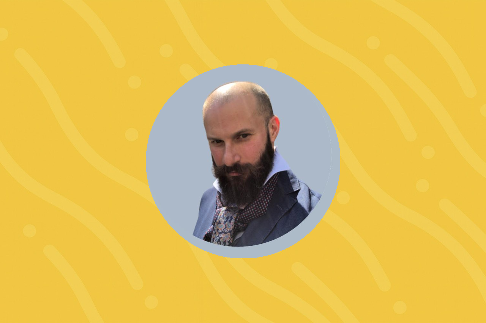

## Chi sono

Drinner,  
Grazie per il tempo che impiegherai nel leggere questa mia candidatura.

Ho avuto la grande fortuna di crescere in una famiglia che mi ha trasmesso l'amore per lo studio e la tecnologia. Ricordo che fin da bambino ho trovato qualcosa di magico nei computer, queste macchine che sono come biciclette per la nostra mente. E quelle macchine divennero magiche quando fu possibile collegarsi a internet. Ricordo ancora lo stupore di potersi scrivere e parlare con persone di tutto il mondo: conoscere nuove idee, nuove prospettive, nuovi mondi.

Per questo decisi di lavorare nel settore delle telecomunicazioni. Mi piaceva pensare che un pezzo del mio lavoro contribuisse a far veicolare pensieri, emozioni, messaggi sui cellulari di speranza, di amore, qualcosa che potesse avvicinare chiunque, anche chi si sentiva molto solo.

La tecnologia è stata per me, da sempre, non solo mera tecnica, ma uno strumento che consente a noi umani di esprimerci, diversamente, forse più profondamente.

Per questo non è per me ammissibile vivere in un paese che non solo non cresce tecnologicamente, ma arretra, inesorabilmente, di anno in anno.

Le ultime scoperte nell'ambito dell'intelligenza artificiale aprono la strada a un mondo nuovo, un mondo dove potremmo sconfiggere le malattie ad oggi incurabili, nel quale potremo vivere tutti meglio e più a lungo.

Io voglio che l'Italia sia parte attiva nella costruzione di questo mondo nuovo, di questa Nuova Atlantide. La tecnologia ci permette di pensare, di osare, un mondo più bello, più giusto, più equo, ma questa nuova frontiera sarà disponibile solo a quei paesi, a quelle società che abbracceranno il cambiamento, che sceglieranno l'innovazione, che rigetteranno le sterili ideologie del passato per qualcosa di nuovo.

Dire che questa forse è la nostra ultima occasione sembra una frase fatta, un artificio retorico. Ma penso che vi sia del vero, in questa visione, per quanto estrema sembri. La tecnologia evolve rapida, sempre più rapida; i nostri giovani più promettenti se ne vanno all'estero, i governi investono in settori a scarso valore aggiunto, invece che in produttività.

Io credo che sia ancora possibile fare qualcosa, e lotterò, nel Drin Dirn, perché sia fatto: la resa non è cosa che mi appartiene.

Se anche tu, Drinner, credi in quello che credo io, votami come delegato. Facciamo crescere le nostre idee, i nostri ideali, il nostro sogno, ora, adesso, in questa nostra Italia, che merita di meglio, di quello che ha avuto da molte decadi ormai.

## Impegno Politico

Drinners, l'Italia è di fronte a una scelta cruciale: restare spettatrice della rivoluzione tecnologica oppure farne parte, cogliendo questa unica opportunità che l'evoluzione scientifica e tecnologica ci offre per dare nuova linfa vitale e speranza di futuro alla nostra Nazione.

I Paesi che hanno una maggiore crescita ed una qualità della vita più alta sono quelli capaci di valorizzare i propri giovani, di attrarre le menti più ricche di passione, di liberare energie creative e offrire contesti in cui sperimentare non sia un privilegio, ma possibilità concreta e strutturata.

Per realizzare ciò, in Italia, propongo una visione integrata, fondata su tre pilastri intimamente connessi: l'**innovazione produttiva**, la **libertà di sviluppo ed impresa**, con un particolare focus sull'**intelligenza artificiale** e la **tutela della salute, fisica e mentale**.

**Il primo pilastro**: immaginiamo un Paese in cui le Big Tech non siano più mete irraggiungibili, ma partner stabili del nostro sistema di ricerca, collocate vicino a campus innovativi inseriti in un sistema universitario e di formazione continua riformato. Questi poli diventeranno motori di sviluppo industriale e di competenze, luoghi dove la ricerca accademica si fonde con la creatività imprenditoriale. Ciò sarà reso possibile da una combinazione di un ecosistema accessibile, normato, con una tassazione competitiva, costruito insieme alle più grandi realtà internazionali.

**Il secondo pilastro** è la libertà di innovare nell'intelligenza artificiale. L'Europa rischia di diventare importatrice netta di soluzioni statunitensi e cinesi se continua a regolamentare la tecnologia invece dei suoi usi specifici. Dobbiamo invertire la rotta: investire in innovazione, diventare un porto sicuro per coloro che vogliono sperimentare: lanciare un nuovo **programma Apollo**, stavolta europeo, per questa corsa all'AI che è la nuova corsa per lo spazio.

**Terzo pilastro** è la salute: **fisica e mentale**. Ogni epoca ha una sua sfida in ambito sanitario: la salute fisica e soprattutto mentale è la sfida di questi nostri giorni. Noi riconosciamo il dolore e la sofferenza di coloro che lottano contro le malattie del fisico e della mente e vogliamo usare ogni strumento medico, scientifico e tecnologico per vincere questa sfida, insieme.

L'**innovazione al servizio di una vita migliore, più sana, più equa**. Questo è il mio programma.

Se anche tu lo condividi, votami come Delegato.

**We have a Drin**